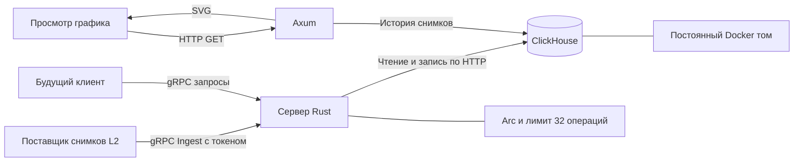
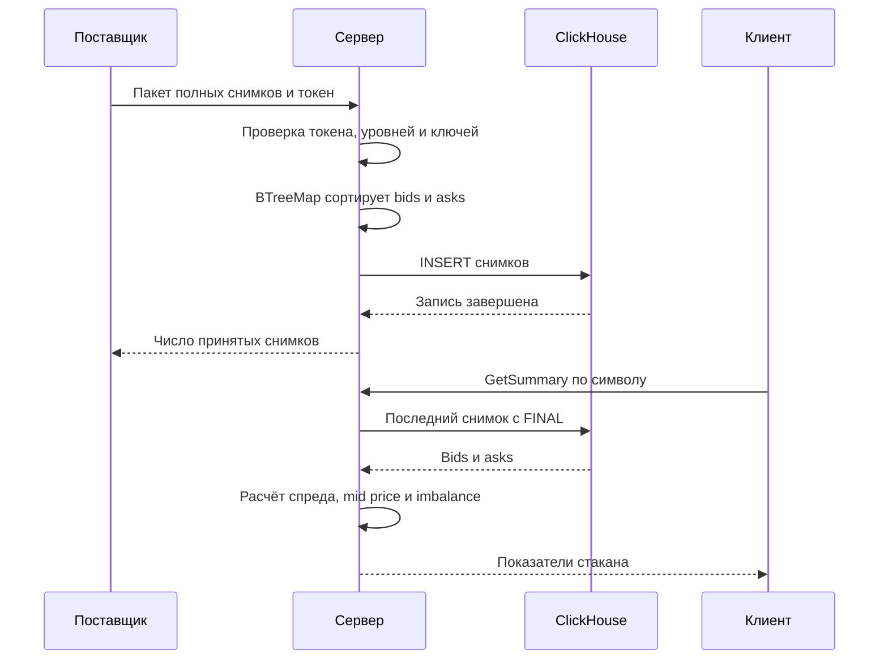
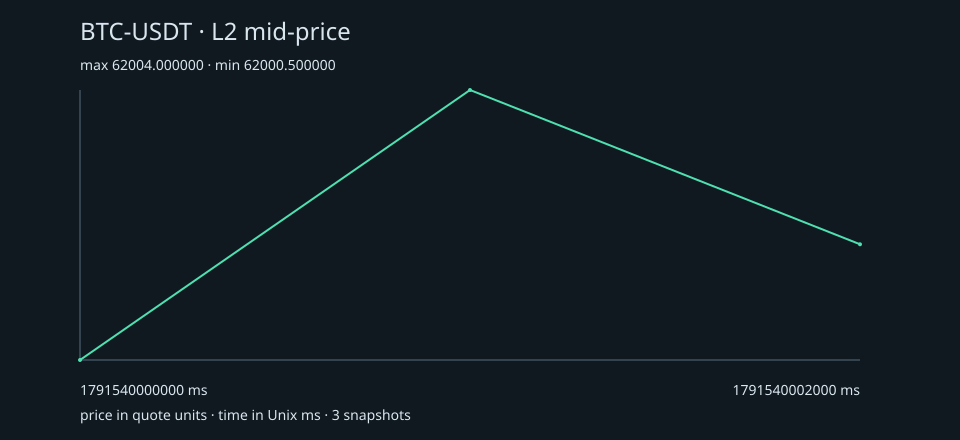

# Сервер стаканов L2

Сервер на Rust для хранения и анализа биржевых стаканов. Он принимает снимки, сохраняет их в ClickHouse и отдаёт данные по gRPC. Для выбранного инструмента можно получить историю, лучшие цены покупки и продажи, спред и соотношение объёмов сторон. По истории сервер строит график средней цены между лучшим bid и ask.

В стакане L2 заявки сгруппированы по цене: на каждом уровне указаны цена и общий объём. Здесь используются полные снимки стакана. Клиент относится к следующей части работы.

## Функциональные требования

| № | Требование | Метод | Проверка |
|---|---|---|---|
| 1 | Принимать и сохранять пакеты снимков стакана. | `Ingest` | Сервер сохраняет пакет и возвращает число снимков. Если хотя бы один снимок неверный, весь пакет отклоняется до записи. |
| 2 | Показывать инструменты, для которых есть данные. | `ListSymbols` | После загрузки инструмент появляется в списке. Список отсортирован по алфавиту. |
| 3 | Возвращать последний снимок инструмента. | `GetLatest` | Сервер выбирает самый поздний снимок. При одинаковом времени берёт больший `sequence`. Если данных нет, возвращает `NOT_FOUND`. |
| 4 | Возвращать снимки за указанный период. | `GetSnapshots` | Ответ содержит снимки из периода `[from_ms, to_ms)`, в порядке времени и `sequence`. |
| 5 | Возвращать нужное число лучших уровней стакана. | `GetDepth` | Можно запросить от 1 до 100 уровней на сторону. При глубине 1 возвращаются лучший bid и лучший ask. |
| 6 | Рассчитывать показатели последнего стакана. | `GetSummary` | В ответе есть лучшие цены, спред, mid price, суммы объёмов и imbalance. |
| 7 | Показывать, за какой период есть данные. | `GetRange` | Сервер возвращает время первого и последнего снимка, а также их число без повторов. |
| 8 | Возвращать историю mid price. | `GetMidPrices` | Каждая точка содержит время, `sequence` и среднее лучших цен bid и ask. |
| 9 | Проверять доступность сервера и базы. | `Health`, `GET /health` | Если база отвечает, сервер возвращает `ok`. Иначе возвращает `UNAVAILABLE` по gRPC или `503` по HTTP. |
| 10 | Строить график mid price за период. | `GET /v1/plot/{symbol}` | График возвращается в SVG. На нём указаны инструмент, время и цены. Если снимков за период нет, сервер возвращает `404`. |

## Нефункциональные требования

| № | Требование | Реализация |
|---|---|---|
| 1 | Хранить исходные цены и объёмы без потери точности. | Цены и объёмы хранятся в `u64` с масштабом `10⁶`. Для вычисляемых показателей используется `double`. |
| 2 | Ограничивать размер запросов и ответов. | До 100 снимков в пакете, 100 уровней на сторону и 100 снимков в ответе. Входное сообщение gRPC ограничено 1 MiB. |
| 3 | Ограничивать нагрузку на базу. | Семафор ограничивает число операций до 32. При превышении возвращается `RESOURCE_EXHAUSTED`. |
| 4 | Ограничивать время запроса. | На запрос HTTP или gRPC отводится 10 секунд, на выполнение запроса в ClickHouse 5 секунд. |
| 5 | Сохранять данные после перезапуска. | Данные ClickHouse сохраняются в постоянном томе Docker. |
| 6 | Не показывать повторные снимки при повторной загрузке. | Снимок определяется символом, временем и `sequence`. Повторы убираются при чтении через `ReplacingMergeTree` и `FINAL`. |
| 7 | Защищать запись данных. | Для `Ingest` нужен `x-write-token`. Токен задаётся через окружение. Порты по умолчанию доступны только локально. |
| 8 | Обрабатывать ошибки без аварийного завершения. | Ошибки возвращаются через `Result`. `unwrap`, `expect`, `panic!` и unsafe запрещены настройками Cargo и Clippy. |
| 9 | Запускать и проверять проект стандартными командами. | Devbox, Cargo и Docker Compose. Проверки запускаются одной командой и в GitHub Actions. |
| 10 | Записывать ошибки и корректно завершать работу. | Ошибки пишутся в лог через `tracing`. `RUST_LOG` задаёт уровень логов. Ctrl+C завершает работу обоих серверов. |

## Как устроен сервер

Сервер работает на Tokio. Tonic и Prost отвечают за gRPC, Axum обслуживает HTTP и строит SVG. Для ClickHouse используется официальный Rust клиент. Сама база работает в контейнере, сервер обращается к ней по HTTP.

Обработчики разделяют `Arc<AppState>` с клиентом базы и семафором. Уровни стакана проходят через `BTreeMap`: это позволяет найти повторные цены и сразу получить нужный порядок. Bids сортируются по убыванию цены, asks по возрастанию. В базу уровни отправляются как `Vec`. Повторные ключи снимков внутри пакета тоже проверяются до записи.

Методы и сообщения описаны в [proto/market.proto](proto/market.proto). Проверять API можно через `grpcurl`.





## Запуск

Для запуска нужны Devbox, Nix и запущенный Docker. Rustup, protoc и grpcurl установит Devbox.

```sh
devbox install
devbox run db
export WRITE_TOKEN=local-homework-token
devbox run start
```

Если Rust 1.92.0 и protoc уже установлены:

```sh
docker compose up -d --wait
export WRITE_TOKEN=local-homework-token
cargo run
```

При запуске сервер создаёт таблицу, если её ещё нет. Пример настроек лежит в [.env.example](.env.example). Их нужно передать через переменные окружения: сам файл `.env` сервер не читает.

| Переменная | Значение по умолчанию |
|---|---|
| `WRITE_TOKEN` | Нужно задать, минимум 16 байт |
| `CLICKHOUSE_URL` | `http://127.0.0.1:8123` |
| `CLICKHOUSE_DATABASE` | `market` |
| `CLICKHOUSE_USER` | `market` |
| `CLICKHOUSE_PASSWORD` | `local-market-password` |
| `GRPC_ADDR` | `127.0.0.1:50051` |
| `HTTP_ADDR` | `127.0.0.1:3000` |
| `CLIENT_ORIGIN` | `http://localhost:5173` |
| `RUST_LOG` | `info` |

## Пример работы

Откройте второй терминал и выполните `devbox shell`. Затем загрузите три снимка из [examples/snapshots.json](examples/snapshots.json):

```sh
grpcurl -plaintext -import-path proto -proto market.proto -H 'x-write-token: local-homework-token' -d @ localhost:50051 market.v1.MarketData/Ingest < examples/snapshots.json
```

Проверка подключения к базе и список инструментов:

```sh
grpcurl -plaintext -import-path proto -proto market.proto -d '{}' localhost:50051 market.v1.MarketData/Health
grpcurl -plaintext -import-path proto -proto market.proto -d '{}' localhost:50051 market.v1.MarketData/ListSymbols
```

Последний стакан, лучшие уровни, показатели и доступный период:

```sh
grpcurl -plaintext -import-path proto -proto market.proto -d '{"symbol":"BTC-USDT"}' localhost:50051 market.v1.MarketData/GetLatest
grpcurl -plaintext -import-path proto -proto market.proto -d '{"symbol":"BTC-USDT","levels":1}' localhost:50051 market.v1.MarketData/GetDepth
grpcurl -plaintext -import-path proto -proto market.proto -d '{"symbol":"BTC-USDT"}' localhost:50051 market.v1.MarketData/GetSummary
grpcurl -plaintext -import-path proto -proto market.proto -d '{"symbol":"BTC-USDT"}' localhost:50051 market.v1.MarketData/GetRange
```

После загрузки в базе будет три снимка `BTC-USDT`. Если отправить тот же файл ещё раз, при чтении всё равно вернутся три снимка.

История стакана и mid price:

```sh
grpcurl -plaintext -import-path proto -proto market.proto -d '{"symbol":"BTC-USDT","fromMs":"1791540000000","toMs":"1791540003000","limit":100}' localhost:50051 market.v1.MarketData/GetSnapshots
grpcurl -plaintext -import-path proto -proto market.proto -d '{"symbol":"BTC-USDT","fromMs":"1791540000000","toMs":"1791540003000","limit":100}' localhost:50051 market.v1.MarketData/GetMidPrices
```

После загрузки примера откройте [график BTC-USDT](http://localhost:3000/v1/plot/BTC-USDT?from_ms=1791540000000&to_ms=1791540003000). Для проверки базы через HTTP откройте [health](http://localhost:3000/health).

### Что получится

В последнем снимке лучший bid равен `62001`, его объём `3`. Лучший ask равен `62003`, его объём `2`. Поэтому показатели будут такими:

| Показатель | Значение |
|---|---|
| Спред | `62003 − 62001 = 2` |
| Mid price | `(62001 + 62003) / 2 = 62002` |
| Imbalance | `(3 − 2) / (3 + 2) = 0.2` |
| История mid price | `62000.5 → 62004 → 62002` |

Этот график получен от сервера после загрузки примера:



[Файл SVG](docs/mid-price.svg). Сохранить график локально:

```sh
curl --fail 'http://localhost:3000/v1/plot/BTC-USDT?from_ms=1791540000000&to_ms=1791540003000' -o /tmp/mid-price.svg
```

## Формат данных

Цены и объёмы передаются целыми числами. Чтобы получить обычное значение, нужно разделить число на `1000000`: цена `62001000000` означает `62001.000000`, объём `1500000` означает `1.500000`. В JSON для protobuf числа `uint64` записываются строками, иначе JavaScript может потерять точность.

Время передаётся в миллисекундах от начала Unix эпохи, в UTC. `sequence` различает снимки с одинаковым временем. Символ обозначает торговую пару на конкретной бирже, поэтому данные с разных бирж нужно записывать под разными символами.

На каждой стороне должно быть от 1 до 100 уровней. Цена и объём должны быть положительными и не больше `10^15`. Повторные цены одной стороны и стаканы, где лучший bid не меньше лучшего ask, отклоняются. Символ содержит от 1 до 32 заглавных латинских букв, цифр или дефисов.

Каждый снимок содержит весь стакан на указанный момент. Если уровень исчез, в следующем снимке его уже нет. Принимаются только полные снимки. Imbalance считается по всем переданным уровням: разница объёмов bids и asks делится на их сумму.

История возвращается за период `[from_ms, to_ms)`. При `limit = 0` используется лимит 100. Если записей больше, ответ содержит `truncated = true`. График в таком случае возвращает `429`: нужно сузить период, чтобы получить полную историю.

Повторная отправка должна содержать те же ключи и данные. Если изменить данные уже записанного снимка, ClickHouse может выбрать последнюю версию. Несколько запросов не объединяются в одну транзакцию. Если при отправке пропало соединение и результат неизвестен, можно повторить исходный пакет.

## Проверка

```sh
devbox run check
devbox run db
devbox run integration
devbox run build
```

`check` запускает проверку форматирования, Clippy без предупреждений и тесты логики. `integration` требует запущенную ClickHouse и проверяет все десять функций через gRPC и HTTP, включая повторную запись, границы периода, лимиты, авторизацию и CORS. Эти же проверки запускаются в GitHub Actions.

Локально прошли форматирование, Clippy, 6 тестов логики, интеграционный тест и сборка release. Команды из примера проверены на работающем сервере. Версии зависимостей зафиксированы в `Cargo.lock` и `devbox.lock`.

## Измерения gRPC

Замеры сделаны на Apple M4. Сервер и программа измерений собраны в release. ClickHouse запущена в Colima с 2 CPU и 4 GiB памяти. Все запросы идут через одно соединение gRPC, без TLS и сжатия.

Перед замером каждого метода отправляется 10 запросов для прогрева, затем ещё 50 запросов с измерением времени. Запросы выполняются по одному. В базе для `BENCH-L2` лежат 20 снимков по 100 уровней на сторону. `GetDepth` запрашивает 10 уровней, `Ingest` повторно записывает один снимок.

Время считается от отправки запроса до получения и декодирования ответа. Подготовка данных и подключение к серверу в замер не входят. p50 означает медиану, p95 показывает время, в которое уложились 95% запросов.

В размер входят protobuf сообщение и 5 байт заголовка gRPC. Служебные данные HTTP/2, TCP и IP не считаются. Для ответа указана наибольшая длина среди 50 запросов.

| Метод | p50, мс | p95, мс | Запрос, байт | Ответ, байт | Успешно |
|---|---:|---:|---:|---:|---:|
| Health | 0.689 | 1.568 | 5 | 9 | 50/50 |
| ListSymbols | 1.245 | 1.518 | 5 | 48 | 50/50 |
| GetLatest | 1.364 | 1.700 | 15 | 2820 | 50/50 |
| GetSnapshots | 1.791 | 2.168 | 31 | 56365 | 50/50 |
| GetDepth | 1.375 | 1.886 | 17 | 300 | 50/50 |
| GetSummary | 1.324 | 2.224 | 15 | 51 | 50/50 |
| GetRange | 1.112 | 1.977 | 15 | 21 | 50/50 |
| GetMidPrices | 1.634 | 1.902 | 31 | 405 | 50/50 |
| Ingest | 54.926 | 63.468 | 2823 | 7 | 50/50 |

Все 450 запросов прошли без ошибок. Это результаты одного локального запуска с последовательными запросами. При параллельной нагрузке время будет другим. Время `Ingest` включает ожидание подтверждения записи от ClickHouse.

Полные результаты с минимальным и максимальным временем лежат в [docs/grpc-metrics.json](docs/grpc-metrics.json). Программа измерений: [examples/measure.rs](examples/measure.rs).

Для повторного замера сначала запустите базу и сервер:

```sh
devbox run db
devbox run build
WRITE_TOKEN=local-homework-token ./target/release/market-data
```

Во втором терминале:

```sh
WRITE_TOKEN=local-homework-token devbox run measure
```

Результат будет записан в `docs/grpc-metrics.json`. При запуске в базу добавляются тестовые снимки `BENCH-L2`.
